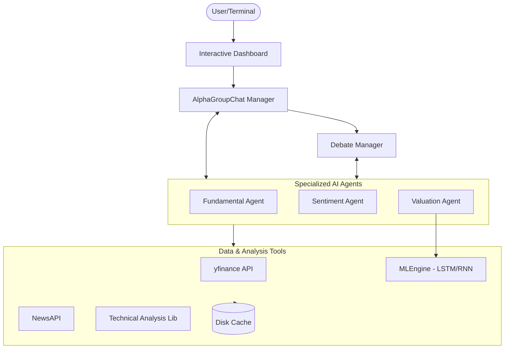
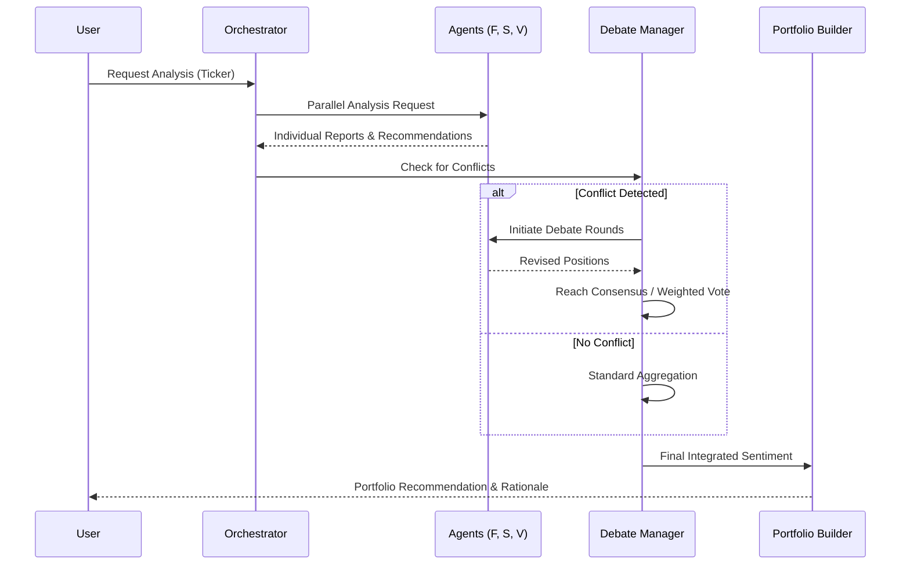
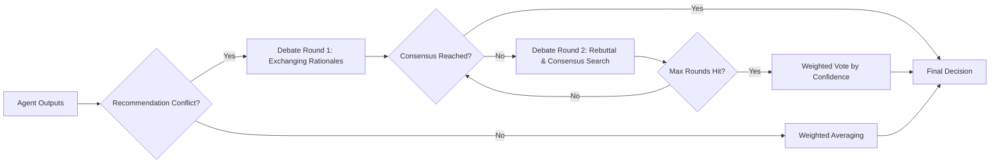

# AlphaAgents 🤖📈

**LLM-Based Multi-Agent Framework for Equity Portfolio Construction**

[](https://www.python.org/downloads/)
[](https://github.com/microsoft/autogen)
[](https://opensource.org/licenses/MIT)

## Overview

AlphaAgents is a production-ready multi-agent investment framework that leverages GPT-4o and Microsoft's AutoGen for collaborative equity research. The system employs specialized AI agents that work together through structured collaboration and debate mechanisms to generate comprehensive stock analyses and portfolio recommendations.

## Key Features

- **🧠 Multi-Agent Collaboration**: Specialized agents with Chain-of-Thought reasoning and self-reflection.
- **🛡️ Advanced Risk Lab**: Hierarchical Risk Parity (HRP), Monte Carlo VaR, and Expected Shortfall (CVaR).
- **🧪 LLM Stress Testing**: Adaptive scenario generation for market crash simulations.
- **📄 Filing Intelligence**: RAG engine for semantic Q&A over SEC 10-K/10-Q documents.
- **🤖 Deep Learning Suite**: LSTM, GRU, and Transformer price forecasting.
- **🎯 Reinforcement Learning**: DQN agent for trading strategy optimization.
- **👁️ Computer Vision**: CNN-based chart pattern recognition.
- **📊 Market Sentiment**: Real-time FinBERT analysis of global news flows.

## Architecture

### System Overview

AlphaAgents utilizes a layered architecture to separate concerns between user interaction, agent orchestration, specialized reasoning, and data acquisition.



### Agent Collaboration Workflow

The system follows a structured collaborative process to reach an investment decision.



### Debate Mechanism Logic

When agents disagree (e.g., Fundamental says "Buy" but Valuation says "Sell"), the Debate Manager intervenes.



## Agents

### 1. Fundamental Agent

Analyzes company fundamentals including:

- 10-K/10-Q SEC filings
- Revenue and earnings trends
- Balance sheet health
- Sector positioning

### 2. Sentiment Agent

Processes market sentiment through:

- Financial news analysis
- Analyst ratings aggregation
- Social sentiment scoring
- Event impact assessment

### 3. Valuation Agent

Evaluates stock valuations via:

- P/E, P/B, EV/EBITDA ratios
- Technical indicators (RSI, MACD)
- Volume analysis
- Price momentum

## Institutional-Grade Intelligence

### 🛡️ Advanced Risk Lab

The AlphaAgents dashboard includes a professional-grade "Risk Lab" terminal for multi-dimensional risk quantification:

- **Hierarchical Risk Parity (HRP)**: Implemented a clustering-based allocation model (`portfolio/risk_models.py`) that organizes assets into a tree structure (dendrogram) to build more robust portfolios than traditional Mean-Variance Optimization.
- **Monte Carlo Value-at-Risk (VaR)**: A simulation engine that runs 10,000+ scenarios to calculate the maximum expected loss at varying confidence levels (90%–99%).
- **Expected Shortfall (CVaR)**: Quantifies "tail risk" by calculating the average loss in the absolute worst-case scenarios.
- **LLM Stress Testing**: Integrated a `StressTester` (`portfolio/stress_testing.py`) that maps your portfolio against both historical crashes (2008 GFC, 2020 COVID) and LLM-generated predictive scenarios like stagflation or credit crunches.

### 📄 Filing Intelligence (RAG Engine)

The platform features a dedicated "Filing Intelligence" tab powered by Retrieval-Augmented Generation for deep document interrogation:

- **Semantic Vector Storage**: Utilizes `faiss` and `sentence-transformers` (`tools/rag_engine.py`) to index complex SEC document chunks.
- **Contextual Q&A**: Users can ask natural language questions directly about 10-K and 10-Q filings. The system retrieves the most relevant passages and synthesizes an answer, grounding the GenAI agents in "hard" regulatory facts.

### 📡 Alpha Signal Generation

The platform synthesizes multi-modal signals into a unified conviction score:

- **AlphaSignalGenerator** (`tools/signals.py`): Combines fundamental, sentiment, technical, and neural model outputs into a single -1 to +1 Alpha Score.
- **Verdict Engine**: Outputs **BULLISH**, **BEARISH**, or **NEUTRAL** classifications with confidence levels.

### ⚙️ Advanced Portfolio Optimization

Enterprise-grade mathematical optimization beyond standard mean-variance:

- **Black-Litterman Model** (`portfolio/optimizers.py`): Integrates agent views (from LLM analysis) with market equilibrium to produce superior allocation weights.
- **Kelly Criterion**: Calculates optimal bet sizing based on win probability and expected payoffs.

### 🌍 Macro Strategist Agent

A specialized agent for global economic analysis:

- **MacroAgent** (`agents/macro_agent.py`): Analyzes Fed policy, inflation regimes, yield curve dynamics, and geopolitical risks.
- **Sector Impact Analysis**: Evaluates how macro factors affect Technology, Energy, and Financial sectors.

### 📊 ESG & Alternative Data

Non-traditional signals for alpha generation:

- **AltDataEngine** (`tools/alt_data.py`): Provides ESG composite scores (Environmental, Social, Governance) and social media buzz metrics.
- **Carbon Intensity Tracking**: Monitors company-level emissions for sustainability-focused portfolios.

### 🤖 Production API Gateway

RESTful interface for programmatic access:

- **FastAPI Bridge** (`api.py`): Exposes `/analyze` and `/results/{job_id}` endpoints for async multi-agent analysis.
- **Background Task Processing**: Handles long-running LLM orchestration without blocking.

### 🧠 Autonomous Memory & Learning

Long-term persistence for continuous improvement:

- **PersistentMemory** (`orchestration/memory_engine.py`): SQLite-backed storage of agent decisions and outcomes.
- **Self-Improvement Loop**: Framework for DSPy-based prompt optimization based on historical accuracy.

### 🔍 Governance & Observability

Audit and monitoring infrastructure:

- **GovernanceMonitor** (`orchestration/monitor.py`): Tracks token usage, latency, and strategy drift across agent operations.
- **Drift Detection**: Alerts when agent recommendations flip significantly on the same ticker.

## Quick Start

```bash
# Clone the repository
git clone https://github.com/yourusername/alpha-agents.git
cd alpha-agents

# Install dependencies
pip install -r requirements.txt

# Set up environment
cp .env.example .env
# Edit .env with your API keys

# Run single stock analysis
python examples/single_stock_analysis.py --ticker AAPL --risk-profile neutral

# Run portfolio construction
python examples/portfolio_construction.py --tickers AAPL,GOOGL,MSFT,NVDA,META
```

## Configuration

Create a `.env` file with:

```env
OPENAI_API_KEY=your_openai_key
NEWS_API_KEY=your_newsapi_key  # Optional
```

## Risk Profiles

### Risk-Averse

- Prioritizes stable, dividend-paying stocks
- Avoids high-beta and volatile positions
- Focuses on margin of safety

### Risk-Neutral

- Balances growth and value opportunities
- Objective sentiment analysis
- Considers momentum alongside fundamentals

## License

MIT License - see [LICENSE](LICENSE) for details.

## Contributing

Contributions welcome! Please read our contributing guidelines first.
