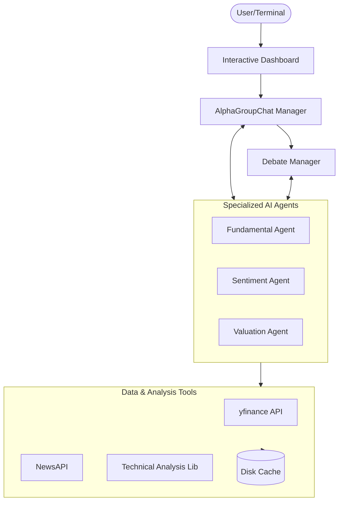

# AlphaAgents 🤖📈

**LLM-Based Multi-Agent Framework for Equity Portfolio Construction**

[](https://www.python.org/downloads/)
[](https://github.com/microsoft/autogen)
[](https://opensource.org/licenses/MIT)

## Overview

AlphaAgents is a production-ready multi-agent investment framework that leverages GPT-4o and Microsoft's AutoGen for collaborative equity research. The system employs specialized AI agents that work together through structured collaboration and debate mechanisms to generate comprehensive stock analyses and portfolio recommendations.

## Key Features

- **🧠 Multi-Agent Collaboration**: Three specialized agents (Fundamental, Sentiment, Valuation) work together
- **⚖️ Debate Mechanism**: Round-robin consensus building for conflicting recommendations
- **📊 Risk Profiles**: Support for risk-averse and risk-neutral investment strategies
- **🔧 Modular Architecture**: Easy to extend with additional agents and tools
- **📈 Real Data Integration**: yfinance, SEC Edgar, NewsAPI integrations

## Architecture

### System Overview

AlphaAgents utilizes a layered architecture to separate concerns between user interaction, agent orchestration, specialized reasoning, and data acquisition.



### Agent Collaboration Workflow

The system follows a structured collaborative process to reach an investment decision.


### Debate Mechanism Logic

When agents disagree (e.g., Fundamental says "Buy" but Valuation says "Sell"), the Debate Manager intervenes.


## Agents

### 1. Fundamental Agent

Analyzes company fundamentals including:

- 10-K/10-Q SEC filings
- Revenue and earnings trends
- Balance sheet health
- Sector positioning

### 2. Sentiment Agent

Processes market sentiment through:

- Financial news analysis
- Analyst ratings aggregation
- Social sentiment scoring
- Event impact assessment

### 3. Valuation Agent

Evaluates stock valuations via:

- P/E, P/B, EV/EBITDA ratios
- Technical indicators (RSI, MACD)
- Volume analysis
- Price momentum

## Quick Start

```bash
# Clone the repository
git clone https://github.com/yourusername/alpha-agents.git
cd alpha-agents

# Install dependencies
pip install -r requirements.txt

# Set up environment
cp .env.example .env
# Edit .env with your API keys

# Run single stock analysis
python examples/single_stock_analysis.py --ticker AAPL --risk-profile neutral

# Run portfolio construction
python examples/portfolio_construction.py --tickers AAPL,GOOGL,MSFT,NVDA,META
```

## Configuration

Create a `.env` file with:

```env
OPENAI_API_KEY=your_openai_key
NEWS_API_KEY=your_newsapi_key  # Optional
```

## Risk Profiles

### Risk-Averse

- Prioritizes stable, dividend-paying stocks
- Avoids high-beta and volatile positions
- Focuses on margin of safety

### Risk-Neutral

- Balances growth and value opportunities
- Objective sentiment analysis
- Considers momentum alongside fundamentals

## License

MIT License - see [LICENSE](LICENSE) for details.

## Contributing

Contributions welcome! Please read our contributing guidelines first.
