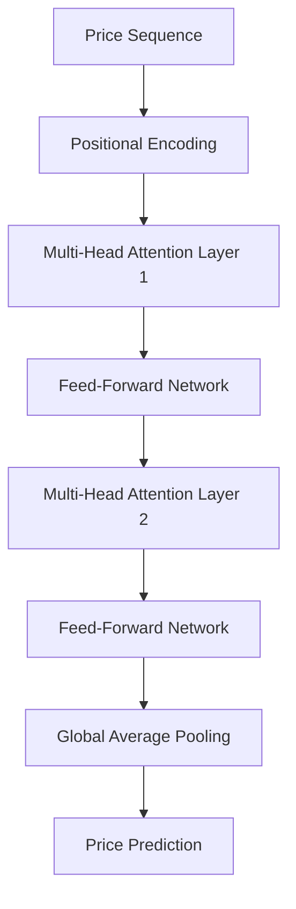
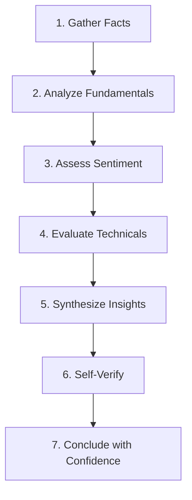

# Neural Network Architecture

AlphaAgents integrates both **Deep Learning** models for quantitative forecasting and **Generative AI** for qualitative reasoning.

## Deep Learning Models

### 1. LSTM (Long Short-Term Memory)

Recurrent neural network for sequential price prediction.

```
Input (60 days) → LSTM(50) → Dropout(0.2) → LSTM(50) → Dropout(0.2) → Dense(25) → Dense(1)
```

**Key Features:**

- Captures long-term temporal dependencies
- Handles vanishing gradient via memory gates (forget, input, output)
- 60-day lookback window

### 2. Transformer Encoder

Attention-based architecture for time-series forecasting.



**Key Features:**

- **Multi-Head Self-Attention**: Captures relationships at all positions simultaneously
- **Positional Encoding**: Injects sequence order via sinusoidal functions
- **Parallel Processing**: Faster training than RNNs
- Hyperparameters: `d_model=64, n_heads=4, n_layers=2`

### 3. GRU (Gated Recurrent Unit)

Lighter alternative to LSTM with similar performance.

```
Input → GRU(50, return_sequences=True) → Dropout(0.2) → GRU(50) → Dropout(0.2) → Dense(1)
```

### 4. Ensemble Method

Combines LSTM and Transformer predictions via simple averaging:

```python
forecast = (lstm_prediction + transformer_prediction) / 2
```

---

## Statistical ML Models

### Isolation Forest (Anomaly Detection)

Unsupervised algorithm for detecting market anomalies.

- **Contamination**: 5% of data points flagged as outliers
- **Features**: Close price change, Volume change
- **Use Case**: Detecting "Black Swan" events

### Random Forest (Feature Importance)

Meta-estimator for understanding price drivers.

- **Target**: Next-day price direction (up/down)
- **Features**: Returns, Volume Change, MA20 Difference
- **Output**: Feature importance scores

---

## Generative AI Integration

### Chain-of-Thought (CoT) Reasoning

Structured multi-step analysis for explainable decisions.



### Self-Reflection Loop

Internal verification mechanism that challenges reasoning:

1. Is the logic sound?
2. Are there biases?
3. What evidence is missing?
4. Would a contrarian view be valid?

### Few-Shot Prompting

System prompts include expert-level examples to guide agent responses toward financial best practices.

---

## Sentiment Analysis

### FinBERT

Pre-trained BERT model fine-tuned on financial text.

- **Model**: `ProsusAI/finbert`
- **Output Classes**: Bullish, Neutral, Bearish
- **Fallback**: Keyword-based scoring

### CNN Text Classifier

1D Convolutional Neural Network for sentiment detection.

```
Embedding → Conv1D(128, kernel=5) → GlobalMaxPool → Dense(64) → Dropout(0.5) → Dense(3, Softmax)
```

---

## Model Selection Guide

| Model       | Speed  | Accuracy | Best For         |
| ----------- | ------ | -------- | ---------------- |
| LSTM        | Medium | High     | Trending markets |
| Transformer | Slow   | Highest  | Complex patterns |
| GRU         | Fast   | Medium   | Quick inference  |
| Ensemble    | Slow   | Highest  | Production use   |
